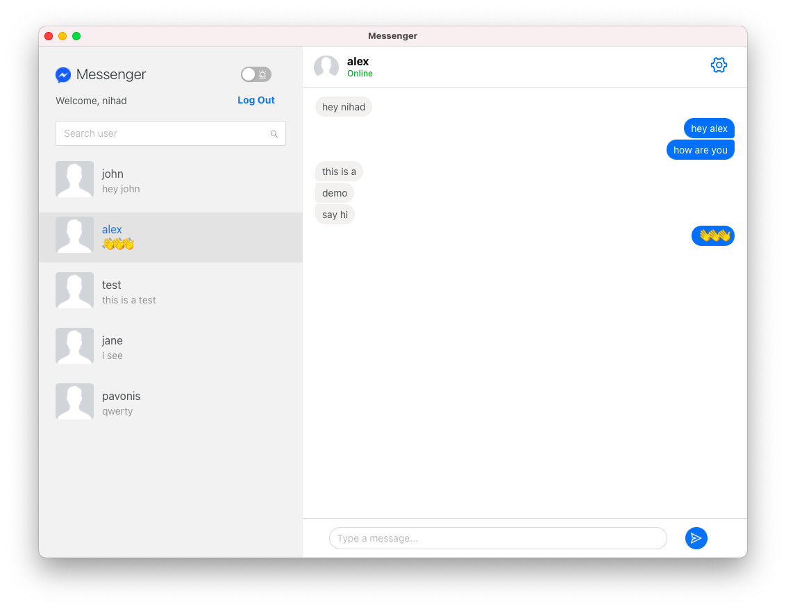
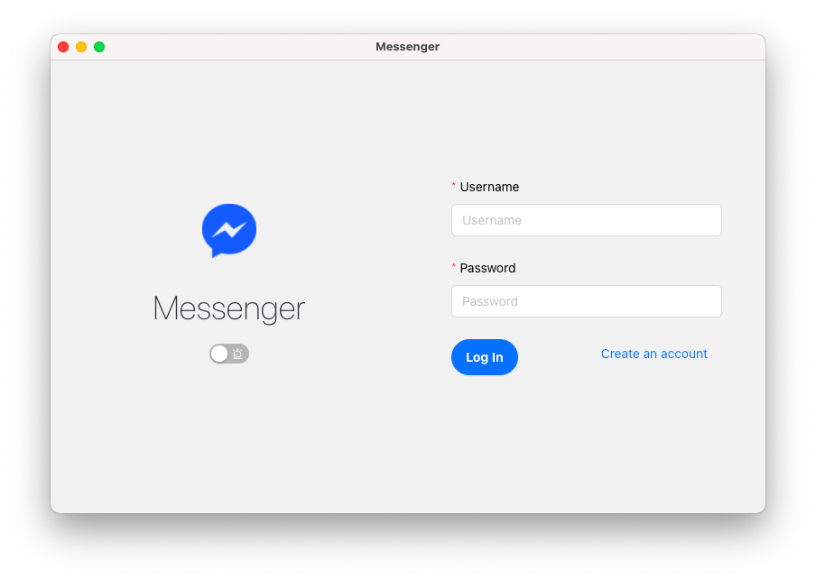
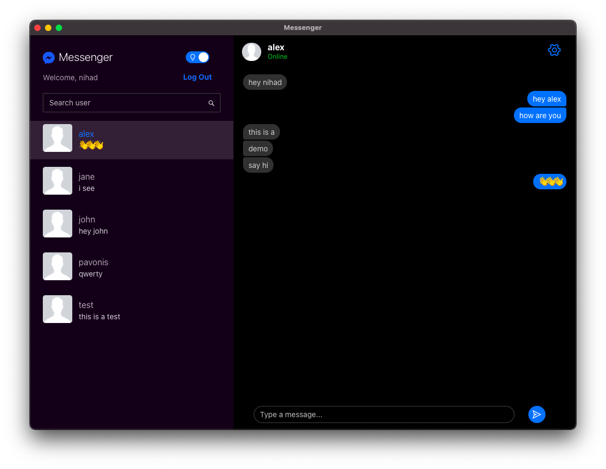

<h1 align="center">Messenger</h1>

<p align="center">Real-time chat application based on the Facebook Messenger app developed with Electron and React</p>



## Features

### Real-time communication

Built with Express and Socket.io, users are able to message each other in real-time.



### Dark mode

Option to toggle between the light and dark mode. Saves it in the local storage.



### Online/offline status

It is possible to see the status of a user whether it's online or offline at the moment.


## Usage

To connect to the database, create `configs.json` file in the root of the project and add your connection string. 
Example for the mongodb atlas:

```
{
  "connectionString": "mongodb+srv://<user-name>:<params>@cluster0.gwmgf.mongodb.net/<project>?retryWrites=true&w=majority"
}
```

After configuring database, execute the following command:

```
npm install && npm run start
```

## Build

See [electron-builder](https://www.electron.build/multi-platform-build).
